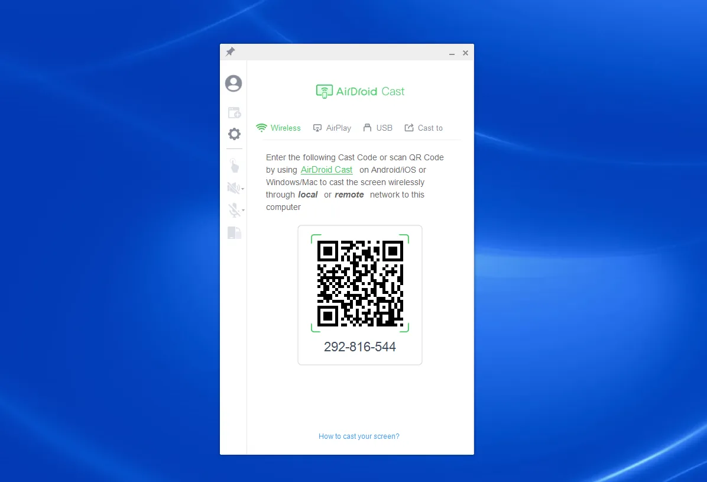
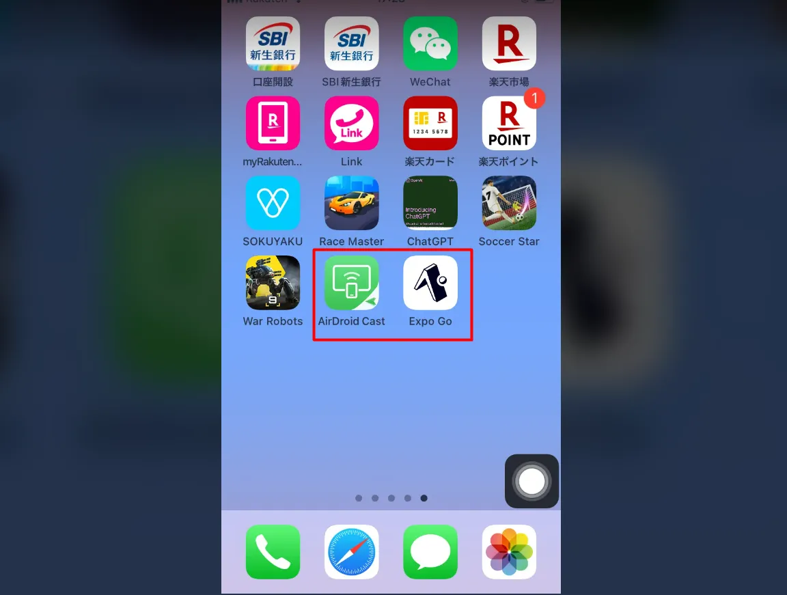
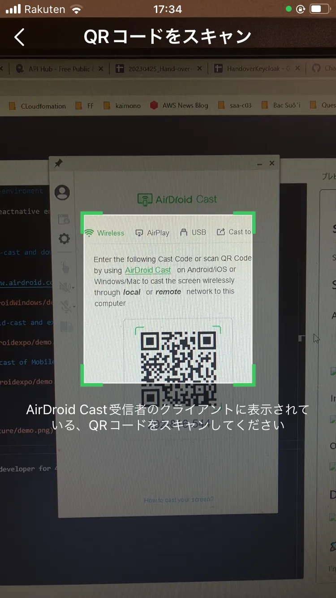
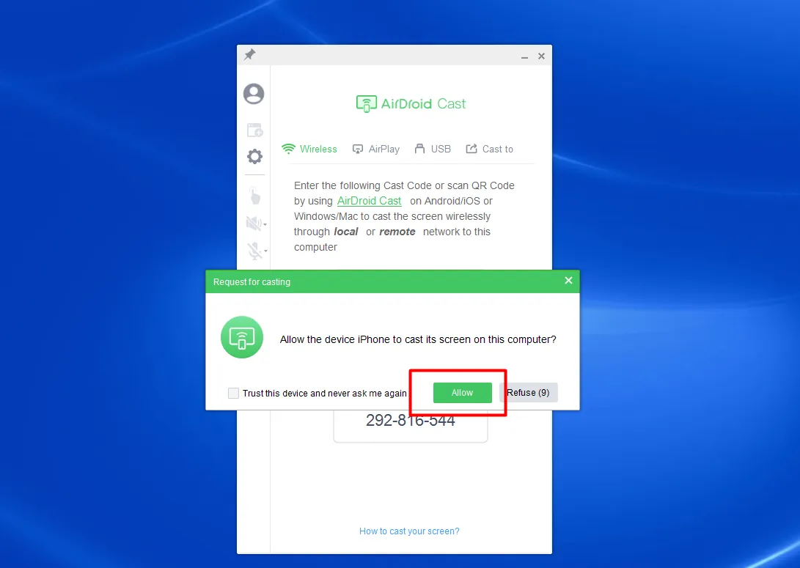
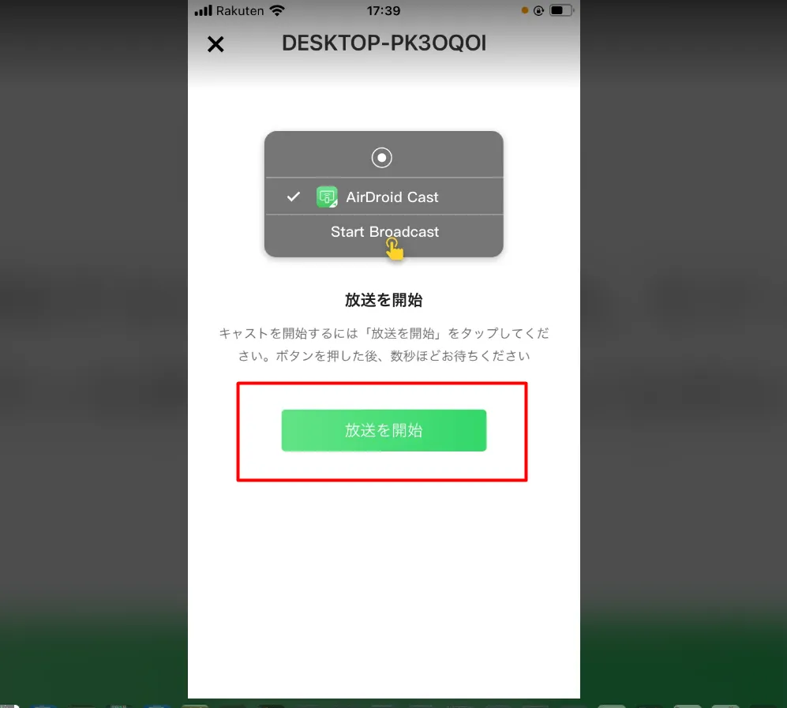
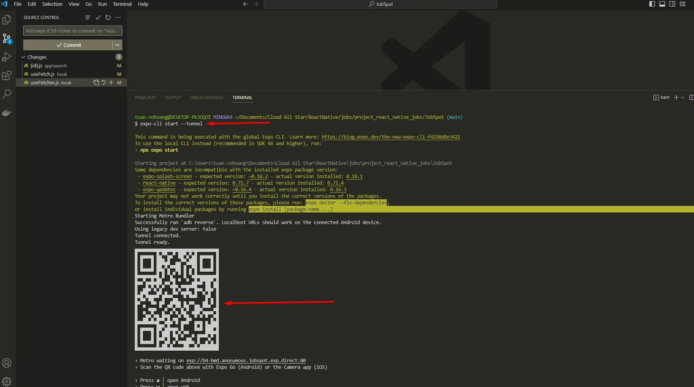
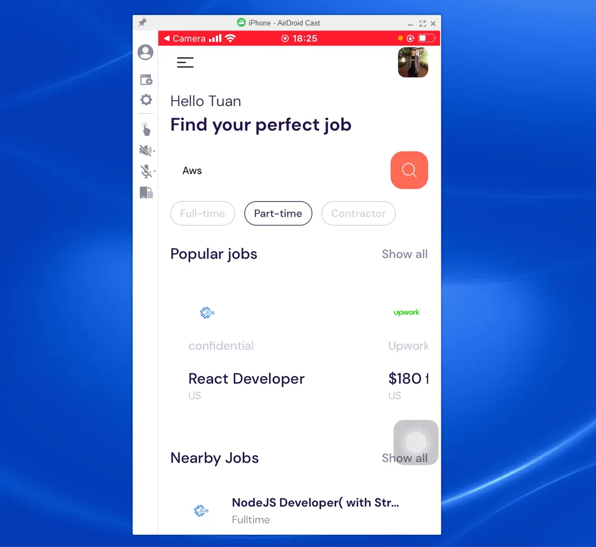

# setup-reactnative-enviroment

Show how to setup reactnative enviroment

## Setup

### Access airdroid-cast and download for Windows

```
access : https://www.airdroid.com/ja/download/airdroid-cast/
```


### Install airdroid-cast and expo-go for Mobile



### Open airdroid-cast of Mobile and Scan QR Code airdroid-cast of Destop



### Allow Mobile Device to link airdroid-cast of Destop



### Start broadcast



### Synchronized Mobile Device with airdroid-cast of Destop


### Run project,scan QR code and click "go to expo go"

```
npm install -g expo-cli
expo-cli start --tunnel
```



### Dont forget 

```
Desktop, Mobile in Same Wifi
```


## Result



## 🚀 About Me

I'm a full stack developer for 4 years
